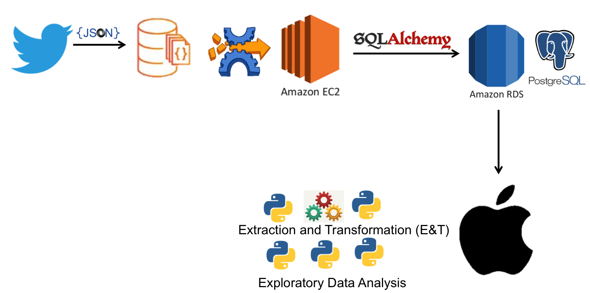
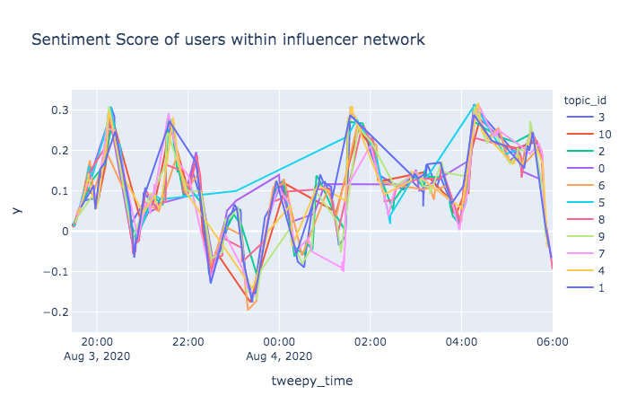
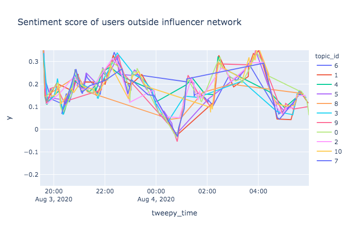
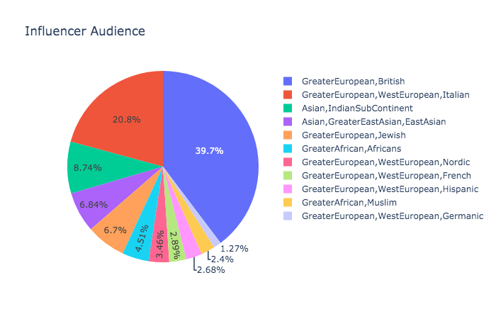
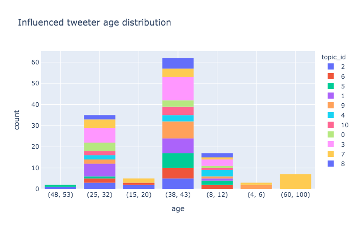
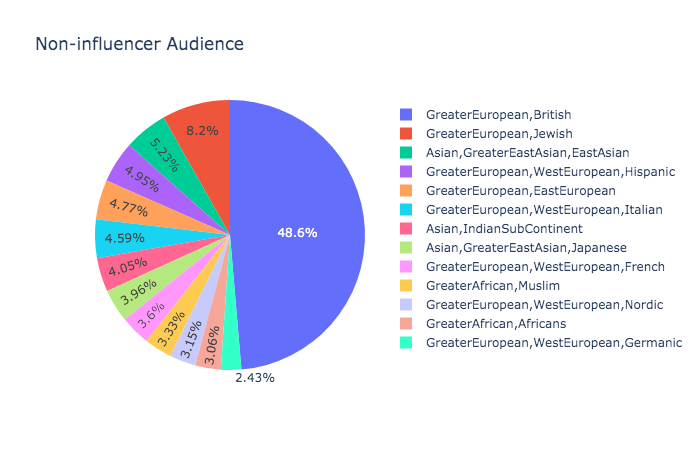
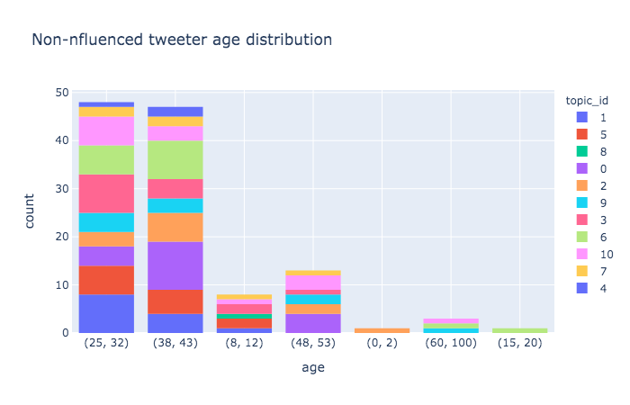

## Tracking Current Opinion on Sustainability

### Description

This is the final project to full fill the curriculum requirements at [Spiced Data Science Bootcamp](https://www.spiced-academy.com/en/program/data-science/berlin). At the moment, it consists of an extensive pipeline to extract incoming tweets on sustainability, use various python libraries to determine demographic information on the tweet authors and make an assessment on the sentiments of each tweet over time. The basic infrastructure of the pipeline has been set with optimization to be conducted over time. Specification on what must be improve upon are specified below.

### Pipeline Outline

To collect tweets, the streamlistener from the tweepy library was used to pick up tweets on sustainability and placed in a mongodb database, to then be segmented and stored in PostgreSQL for later extraction and transformation. The data was later retrieved from the postgres tables and analyzed locally for gender, age, ethnicity, geo-location and topic modeling. Greater detail on the specifics of extraction and transformation will be elaborated at a later time point.

### Tech List

- 

### Initial Findings

Initial data was collected over-night in about a 12 hour window. Sentiment score for the tweets experienced a fluctuation 10pm-2am. In order to explore this, the retweet network was reexamined to determine what impact users with a important/critical connections have on this fluctuation. The following shows the difference in sentiment score trend over time between tweeters within 'our future bot' user network (n=698) and those outside that user's network (n=419).

Based on the images above and other exploratory data analysis (EDA) about 'out future bot' not shown here, it's determined that the user is a tweet bot that targeted users as those who perhaps consistently tweet negatively about sustainability. Further graphs below summarize demographics between the users.

This initial analysis demonstrates the effect of tweet bots have on twitter data and also indicates the need of an implementation in the pipeline to eliminate tweet bot tweets prior to analysis.
